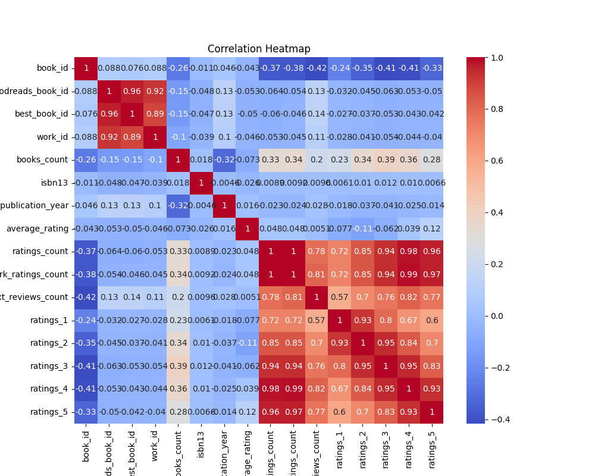
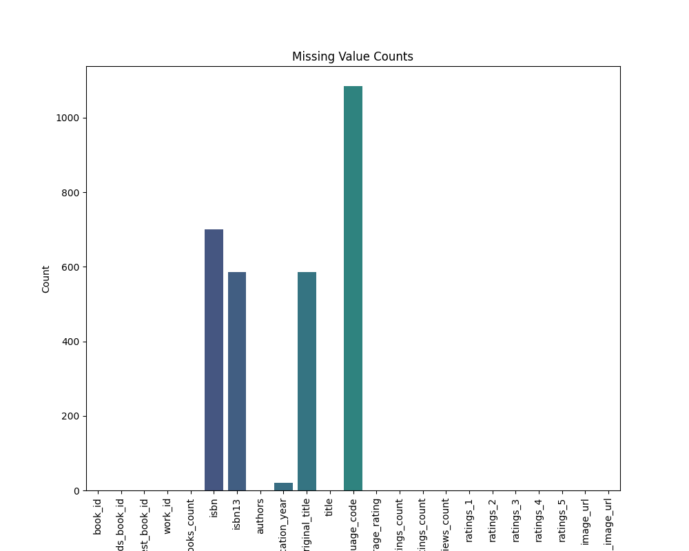
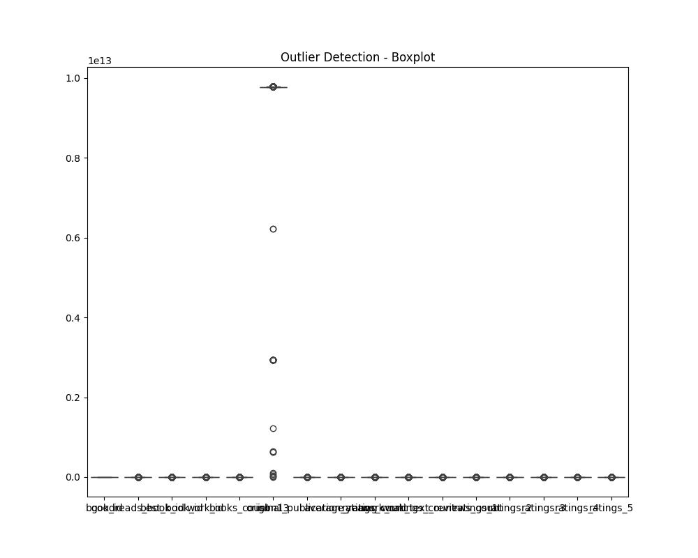

# Analysis Report

## Dataset Overview

Columns: book_id, goodreads_book_id, best_book_id, work_id, books_count, isbn, isbn13, authors, original_publication_year, original_title, title, language_code, average_rating, ratings_count, work_ratings_count, work_text_reviews_count, ratings_1, ratings_2, ratings_3, ratings_4, ratings_5, image_url, small_image_url

## Analysis Summary

The analysis of the dataset reveals several key insights and patterns related to the collection of books captured in its columns. Below are the notable findings and their potential implications:

### Summary Statistics and Missing Values
The dataset consists of 10,000 entries, with a variety of attributes related to books, such as ratings, authorship, and publication details. It is noteworthy that certain columns contain missing values, including `isbn` (7%), `isbn13` (5.85%), and `original_publication_year` (0.21%). The absence of these data points may impact analyses related to book identification and historical trends.

### Distribution & Uniqueness
The book IDs and Goodreads IDs are uniquely assigned to each entry, which aids reliability in identification. However, there is a high degree of variability in certain attributes like `books_count` (597 unique values) and `ratings_count` (9,003 unique values), indicating a wide range of popularity among the books in the dataset.

### Correlations
A strong correlation has been identified between `work_ratings_count` and `ratings_count` (0.995), suggesting that the number of ratings received is closely tied to the number of reviews generated. Similarly, other rating categories also correlate significantly, indicating that higher ratings often accompany increased reader engagement metrics. This insight can guide marketing strategies to bolster reader involvement for lesser-rated books.

### Outliers Detection
Outlier values were detected in several metrics, particularly in `original_publication_year` (with an outlier year of 990), `average_rating` (151 – likely an erroneous entry), and ratings (count exceeding normal ranges). These outliers could skew analyses and may need correction or exclusion depending on their authenticity.

### Data Distributions & Skewness
The dataset exhibits pronounced skewness in attributes such as `books_count` and `ratings_count`, highlighting that a small number of books receive a substantial amount of ratings — often a characteristic of popular titles. The kurtosis values further support these findings, indicating heavy-tailed distributions which suggest that extreme values are more common than in normal distributions. 

### Categorical Insights and Notable Authors
A diverse array of authors is represented in the dataset, with over 4,664 unique names, suggesting a rich variety in the genres and styles of literature. The most frequently occurring authors and titles may provide valuable insights into market trends and reader preferences.

### Geographical Summary
The geographic summary hints at a broad latitude and longitude range, indicating the

## Visualizations

