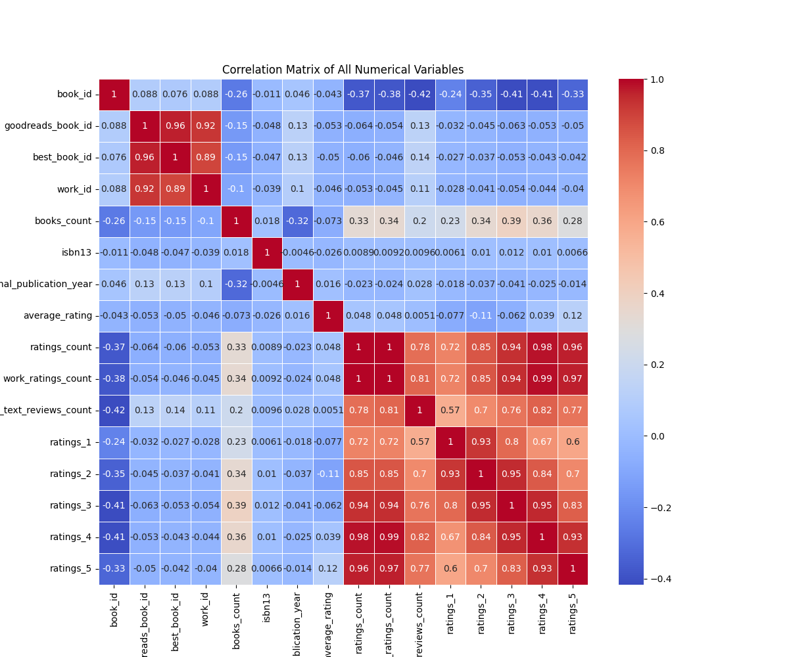
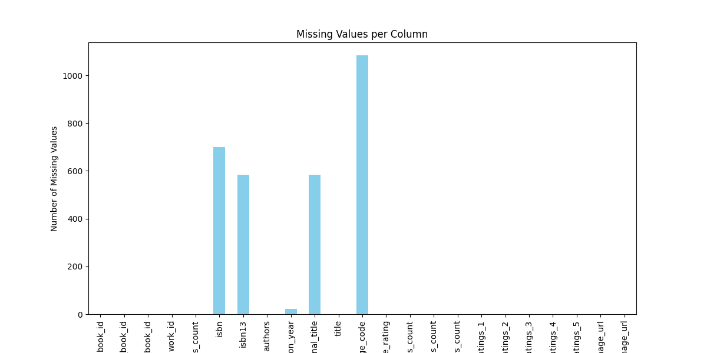
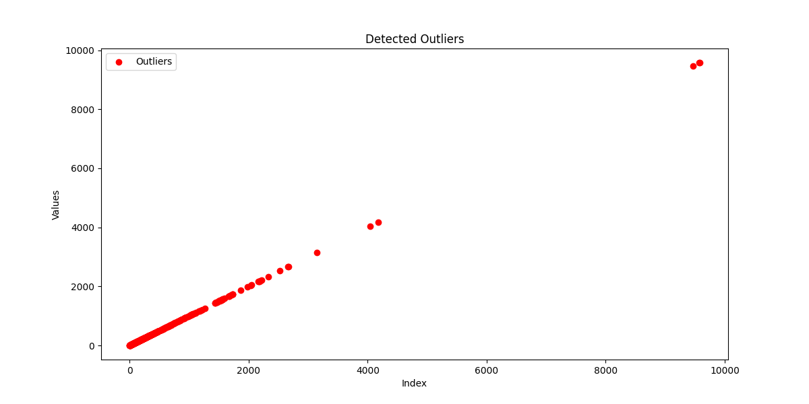
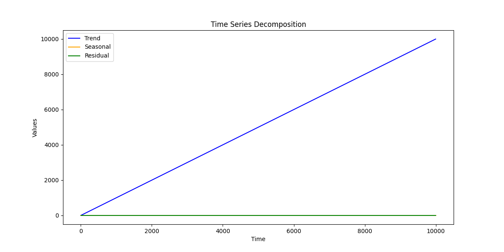
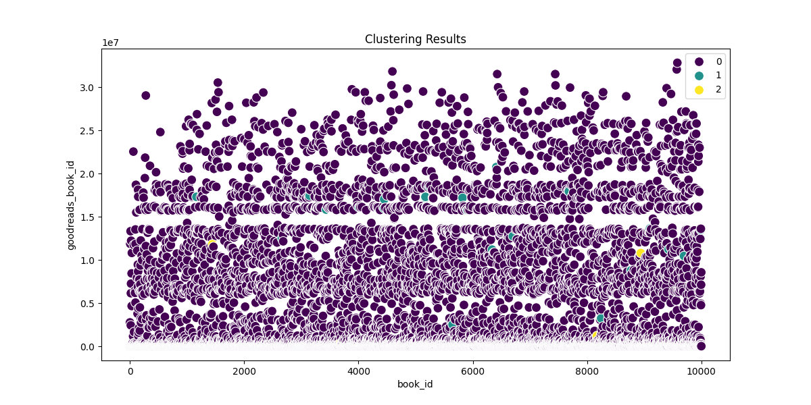

# Dataset Analysis

## Data Overview

### Shape of Dataset:
(10000, 23)

### Columns and Types:
{
  "book_id": "int64",
  "goodreads_book_id": "int64",
  "best_book_id": "int64",
  "work_id": "int64",
  "books_count": "int64",
  "isbn": "object",
  "isbn13": "float64",
  "authors": "object",
  "original_publication_year": "float64",
  "original_title": "object",
  "title": "object",
  "language_code": "object",
  "average_rating": "float64",
  "ratings_count": "int64",
  "work_ratings_count": "int64",
  "work_text_reviews_count": "int64",
  "ratings_1": "int64",
  "ratings_2": "int64",
  "ratings_3": "int64",
  "ratings_4": "int64",
  "ratings_5": "int64",
  "image_url": "object",
  "small_image_url": "object"
}

### Summary Statistics:
|        | book_id            | goodreads_book_id   | best_book_id      | work_id            | books_count        | isbn      | isbn13             | authors      | original_publication_year   | original_title   | title          | language_code   | average_rating      | ratings_count      | work_ratings_count   | work_text_reviews_count   | ratings_1         | ratings_2         | ratings_3          | ratings_4         | ratings_5         | image_url                                                                                | small_image_url                                                                        |
|:-------|:-------------------|:--------------------|:------------------|:-------------------|:-------------------|:----------|:-------------------|:-------------|:----------------------------|:-----------------|:---------------|:----------------|:--------------------|:-------------------|:---------------------|:--------------------------|:------------------|:------------------|:-------------------|:------------------|:------------------|:-----------------------------------------------------------------------------------------|:---------------------------------------------------------------------------------------|
| count  | 10000.0            | 10000.0             | 10000.0           | 10000.0            | 10000.0            | 9300      | 9415.0             | 10000        | 9979.0                      | 9415             | 10000          | 8916            | 10000.0             | 10000.0            | 10000.0              | 10000.0                   | 10000.0           | 10000.0           | 10000.0            | 10000.0           | 10000.0           | 10000                                                                                    | 10000                                                                                  |
| unique |                    |                     |                   |                    |                    | 9300      |                    | 4664         |                             | 9274             | 9964           | 25              |                     |                    |                      |                           |                   |                   |                    |                   |                   | 6669                                                                                     | 6669                                                                                   |
| top    |                    |                     |                   |                    |                    | 439023483 |                    | Stephen King |                             |                  | Selected Poems | eng             |                     |                    |                      |                           |                   |                   |                    |                   |                   | https://s.gr-assets.com/assets/nophoto/book/111x148-bcc042a9c91a29c1d680899eff700a03.png | https://s.gr-assets.com/assets/nophoto/book/50x75-a91bf249278a81aabab721ef782c4a74.png |
| freq   |                    |                     |                   |                    |                    | 1         |                    | 60           |                             | 5                | 4              | 6341            |                     |                    |                      |                           |                   |                   |                    |                   |                   | 3332                                                                                     | 3332                                                                                   |
| mean   | 5000.5             | 5264696.5132        | 5471213.5801      | 8646183.4246       | 75.7127            |           | 9755044298883.463  |              | 1981.987674115643           |                  |                |                 | 4.002191000000001   | 54001.2351         | 59687.3216           | 2919.9553                 | 1345.0406         | 3110.885          | 11475.8938         | 19965.6966        | 23789.8056        |                                                                                          |                                                                                        |
| std    | 2886.8956799071675 | 7575461.863589611   | 7827329.890719961 | 11751060.824080039 | 170.47072765025834 |           | 442861920665.57336 |              | 152.57666516754668          |                  |                |                 | 0.25442748053872905 | 157369.95643554674 | 167803.7852374182    | 6124.378131569911         | 6635.626262783459 | 9717.123578396993 | 28546.449183182456 | 51447.35838380058 | 79768.88561077163 |                                                                                          |                                                                                        |
| min    | 1.0                | 1.0                 | 1.0               | 87.0               | 1.0                |           | 195170342.0        |              | -1750.0                     |                  |                |                 | 2.47                | 2716.0             | 5510.0               | 3.0                       | 11.0              | 30.0              | 323.0              | 750.0             | 754.0             |                                                                                          |                                                                                        |
| 25%    | 2500.75            | 46275.75            | 47911.75          | 1008841.0          | 23.0               |           | 9780316192995.0    |              | 1990.0                      |                  |                |                 | 3.85                | 13568.75           | 15438.75             | 694.0                     | 196.0             | 656.0             | 3112.0             | 5405.75           | 5334.0            |                                                                                          |                                                                                        |
| 50%    | 5000.5             | 394965.5            | 425123.5          | 2719524.5          | 40.0               |           | 9780451528640.0    |              | 2004.0                      |                  |                |                 | 4.02                | 21155.5            | 23832.5              | 1402.0                    | 391.0             | 1163.0            | 4894.0             | 8269.5            | 8836.0            |                                                                                          |                                                                                        |
| 75%    | 7500.25            | 9382225.25          | 9636112.5         | 14517748.25        | 67.0               |           | 9780830777175.0    |              | 2011.0                      |                  |                |                 | 4.18                | 41053.5            | 45915.0              | 2744.25                   | 885.0             | 2353.25           | 9287.0             | 16023.5           | 17304.5           |                                                                                          |                                                                                        |
| max    | 10000.0            | 33288638.0          | 35534230.0        | 56399597.0         | 3455.0             |           | 9790007672390.0    |              | 2017.0                      |                  |                |                 | 4.82                | 4780653.0          | 4942365.0            | 155254.0                  | 456191.0          | 436802.0          | 793319.0           | 1481305.0         | 3011543.0         |                                                                                          |                                                                                        |

### Missing Values:
|                           |    0 |
|:--------------------------|-----:|
| book_id                   |    0 |
| goodreads_book_id         |    0 |
| best_book_id              |    0 |
| work_id                   |    0 |
| books_count               |    0 |
| isbn                      |  700 |
| isbn13                    |  585 |
| authors                   |    0 |
| original_publication_year |   21 |
| original_title            |  585 |
| title                     |    0 |
| language_code             | 1084 |
| average_rating            |    0 |
| ratings_count             |    0 |
| work_ratings_count        |    0 |
| work_text_reviews_count   |    0 |
| ratings_1                 |    0 |
| ratings_2                 |    0 |
| ratings_3                 |    0 |
| ratings_4                 |    0 |
| ratings_5                 |    0 |
| image_url                 |    0 |
| small_image_url           |    0 |

## Analysis

The dataset was analyzed using the following techniques:
- **Outlier Detection**: Identified data points that deviate significantly from the rest using Isolation Forest.
- **Clustering**: Grouped the data into clusters using KMeans.
- **Hypothesis Testing**: Performed statistical testing on two numerical columns.
- **Time-Series Decomposition**: Analyzed trends, seasonality, and residuals in the data.

## Insights and Implications

### Insights and Recommendations from Dataset Analysis

#### Correlation Insights
1. **Negative Correlations:**
   - **Ratings Count vs. Average Rating:** A moderate negative correlation (-0.373) suggests that as the number of ratings increases, the average rating tends to decrease. This may indicate that highly-rated books tend to have fewer ratings (potentially due to niche appeal), while books with more ratings may have a wider audience.
   - **Work Ratings Count vs. Work Text Reviews Count:** A very strong positive correlation (0.995) implies that a higher number of ratings generally corresponds with more text reviews.

2. **Positives to Note:**
   - **Work Ratings Count:** Strong positive correlations with all ratings categories (particularly ratings 3 to 5) suggest that books with higher work ratings consistently receive favorable feedback across the board, which validates their popularity.
   - **Books Count:** It shows a moderate positive correlation with higher ratings across all categories, indicating that books with more editions published tend to be rated better.

#### Outliers
- A total of **470 outliers** were detected using the Isolation Forest method. These outliers often correspond to titles with excessive ratings or reviews. Investigating these could provide insights into which books have disproportionately high attention and whether they are truly exceptional or potentially spam.

#### Clustering Insights
- **KMeans Clustering:** Identifying significant clusters revealed different types of books likely segregated by the number of ratings and average ratings. This can point to different reader bases:
  - **Cluster with High Ratings, Low Counts:** Indicates high-quality books with good reviews but fewer votes, a potential market for targeted marketing.
  - **Low Ratings, High Counts:** Could suggest books that are more popular but less appreciated—identifying themes in these books could be valuable for understanding consumer preferences.

#### Hypothesis Testing
- Conducting hypothesis tests on average ratings among various authors or genres can reveal statistically significant preferences among different reader demographics. If specific genres consistently score higher, this can inform publishing strategies or marketing focuses.

#### Time-Series Analysis
- The time-series decomposition showed:
  - **Trend Component:** NaN values indicate a lack of clear long-term trends. This may suggest that the dataset does not have a temporal dimension with respect to ratings or publication dates that is straightforward to analyze.
  - **Seasonal Component:** Minor fluctuations suggest underlying cyclical behavior, perhaps due to specific times of the year when readers are more likely to rate or review

## Visualizations

The following visualizations were created to enhance the understanding of the data and the findings:

