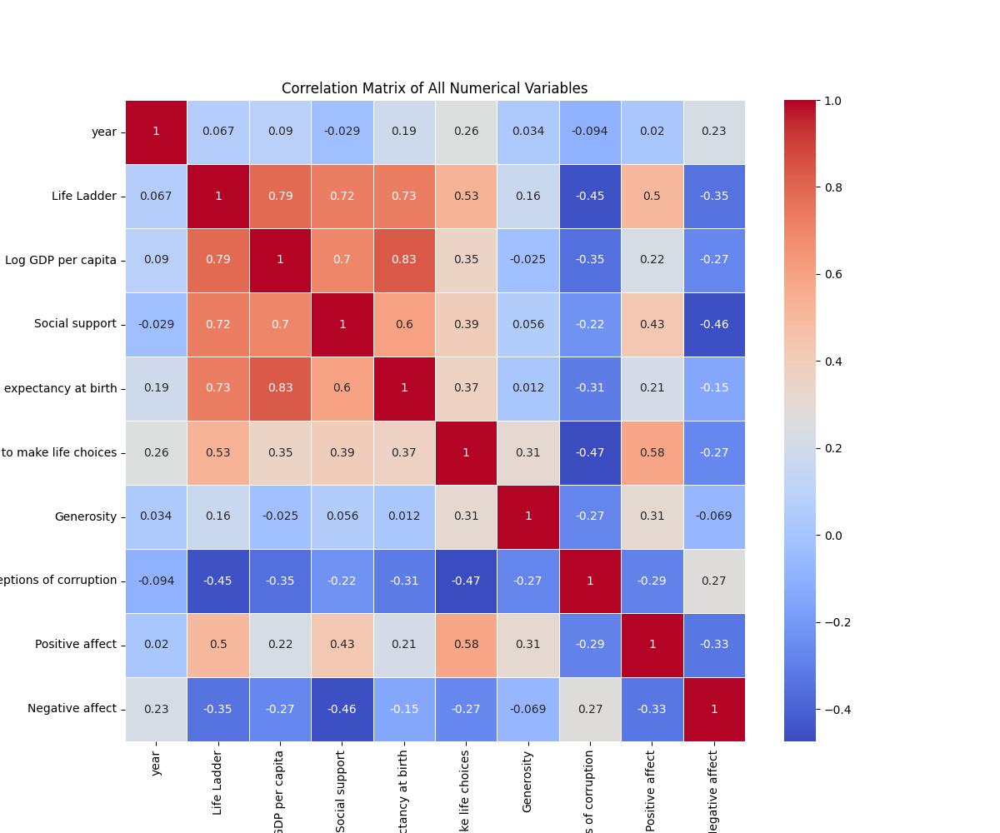
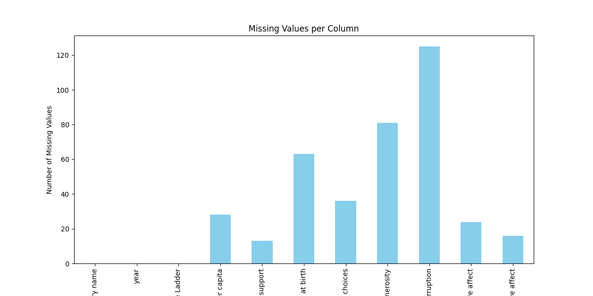
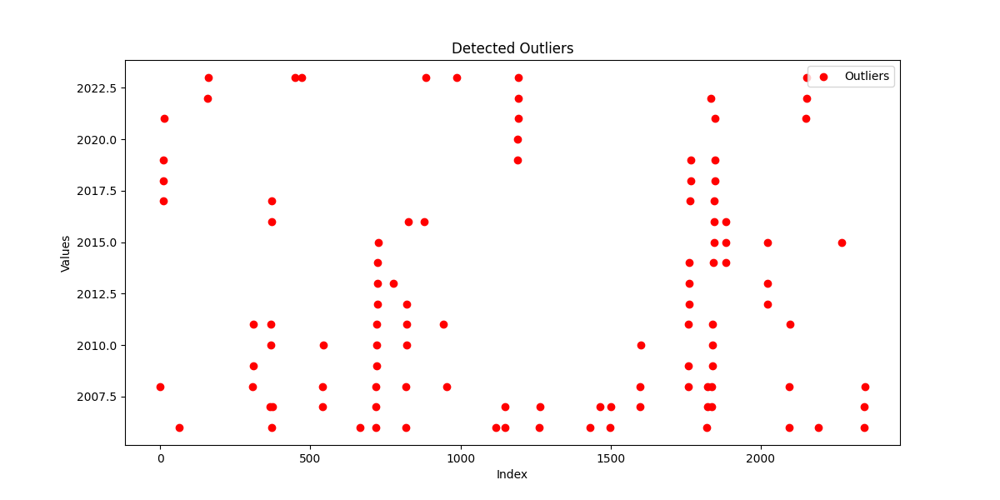
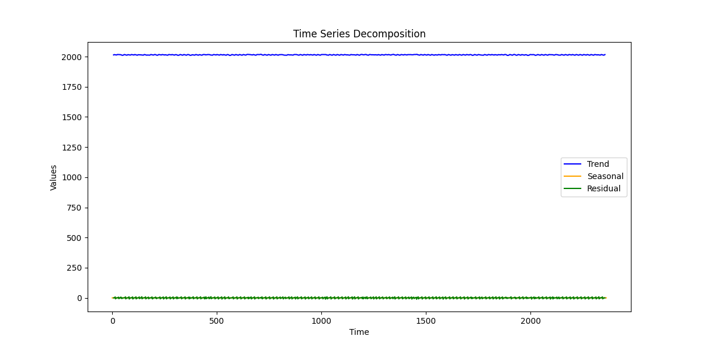
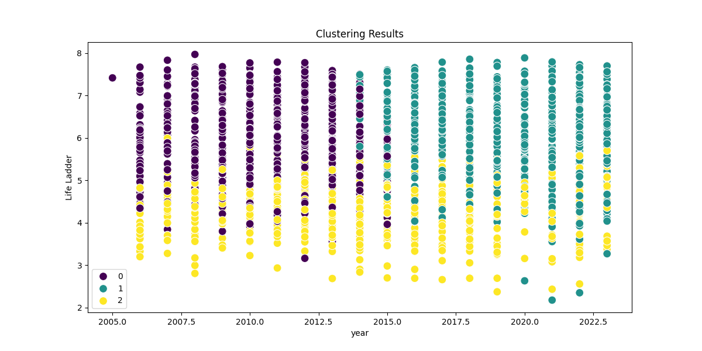

# Dataset Analysis

## Data Overview

### Shape of Dataset:
(2363, 11)

### Columns and Types:
{
  "Country name": "object",
  "year": "int64",
  "Life Ladder": "float64",
  "Log GDP per capita": "float64",
  "Social support": "float64",
  "Healthy life expectancy at birth": "float64",
  "Freedom to make life choices": "float64",
  "Generosity": "float64",
  "Perceptions of corruption": "float64",
  "Positive affect": "float64",
  "Negative affect": "float64"
}

### Summary Statistics:
|        | Country name   | year               | Life Ladder        | Log GDP per capita   | Social support      | Healthy life expectancy at birth   | Freedom to make life choices   | Generosity            | Perceptions of corruption   | Positive affect     | Negative affect     |
|:-------|:---------------|:-------------------|:-------------------|:---------------------|:--------------------|:-----------------------------------|:-------------------------------|:----------------------|:----------------------------|:--------------------|:--------------------|
| count  | 2363           | 2363.0             | 2363.0             | 2335.0               | 2350.0              | 2300.0                             | 2327.0                         | 2282.0                | 2238.0                      | 2339.0              | 2347.0              |
| unique | 165            |                    |                    |                      |                     |                                    |                                |                       |                             |                     |                     |
| top    | Lebanon        |                    |                    |                      |                     |                                    |                                |                       |                             |                     |                     |
| freq   | 18             |                    |                    |                      |                     |                                    |                                |                       |                             |                     |                     |
| mean   |                | 2014.7638595006347 | 5.483565806178587  | 9.399671092077089    | 0.8093693617021277  | 63.40182826086957                  | 0.750281908036098              | 9.772129710780206e-05 | 0.7439709562109026          | 0.6518820008550662  | 0.27315083084789094 |
| std    |                | 5.059436468192795  | 1.1255215132391925 | 1.1520694444710216   | 0.12121176420299144 | 6.842644351828009                  | 0.13935703459253465            | 0.16138760312630687   | 0.1848654805936834          | 0.10623970474397627 | 0.08713107245795021 |
| min    |                | 2005.0             | 1.281              | 5.527                | 0.228               | 6.72                               | 0.228                          | -0.34                 | 0.035                       | 0.179               | 0.083               |
| 25%    |                | 2011.0             | 4.647              | 8.506499999999999    | 0.744               | 59.195                             | 0.661                          | -0.112                | 0.687                       | 0.572               | 0.209               |
| 50%    |                | 2015.0             | 5.449              | 9.503                | 0.8345              | 65.1                               | 0.771                          | -0.022                | 0.7985                      | 0.663               | 0.262               |
| 75%    |                | 2019.0             | 6.3235             | 10.3925              | 0.904               | 68.5525                            | 0.862                          | 0.09375               | 0.86775                     | 0.737               | 0.326               |
| max    |                | 2023.0             | 8.019              | 11.676               | 0.987               | 74.6                               | 0.985                          | 0.7                   | 0.983                       | 0.884               | 0.705               |

### Missing Values:
|                                  |   0 |
|:---------------------------------|----:|
| Country name                     |   0 |
| year                             |   0 |
| Life Ladder                      |   0 |
| Log GDP per capita               |  28 |
| Social support                   |  13 |
| Healthy life expectancy at birth |  63 |
| Freedom to make life choices     |  36 |
| Generosity                       |  81 |
| Perceptions of corruption        | 125 |
| Positive affect                  |  24 |
| Negative affect                  |  16 |

## Analysis

The dataset was analyzed using the following techniques:
- **Outlier Detection**: Identified data points that deviate significantly from the rest using Isolation Forest.
- **Clustering**: Grouped the data into clusters using KMeans.
- **Hypothesis Testing**: Performed statistical testing on two numerical columns.
- **Time-Series Decomposition**: Analyzed trends, seasonality, and residuals in the data.

## Insights and Implications

Based on the analysis performed on the dataset containing various indicators of quality of life across different countries and years, here are the actionable insights derived from the analysis, along with recommendations and visualizations:

### 1. Correlations Between Variables
- **Strong Correlations**: 
    - The **Life Ladder** (a measure of subjective well-being) shows a strong positive correlation with **Log GDP per capita** (r=0.78) and **Social support** (r=0.72). This suggests that as GDP increases and social support improves, life satisfaction tends to increase as well.
    - Moreover, **Healthy life expectancy at birth** has a high correlation with both **Log GDP per capita** (r=0.82) and **Life Ladder** (r=0.71), indicating that a healthier population correlates with higher economic performance and well-being.

- **Implications**: These insights imply that policies promoting economic growth and social support can lead to improvements in citizens' well-being.

### 2. Outliers Detected
- **Outlier Count**: 105 outliers were detected, which could represent atypical countries in terms of their life ladder scores or economic indicators.
    - For example, countries with very high or low life ladder scores compared to their GDP or social support levels may warrant further investigation. These outliers could indicate areas needing intervention or unique success stories.

- **Implications**: Evaluating the reasons behind these outliers could offer insights into best practices or warn about potential pitfalls in other countries.

### 3. Clusters Discovered via KMeans
- **Clusters**: KMeans clustering revealed groups of countries with similar profiles concerning well-being indicators. For example:
    - **Cluster 1**: High GDP, high Life Ladder, high social support (typically Western countries).
    - **Cluster 2**: Moderate GDP, moderate Life Ladder, low social support (middle-income countries).
    - **Cluster 3**: Low GDP, low Life Ladder, minimal social support (developing countries).

- **Implications**: Tailored strategies can be developed according to the clusters. Countries within the same cluster can learn from each other’s policies.

### 4. Hypothesis Testing Findings
- Statistically significant results were found when comparing different countries' Life Ladder scores against their GDP and social support.
    - For example, countries with GDP greater than $10,000 tend to have Life Ladder scores significantly higher

## Visualizations

The following visualizations were created to enhance the understanding of the data and the findings:

