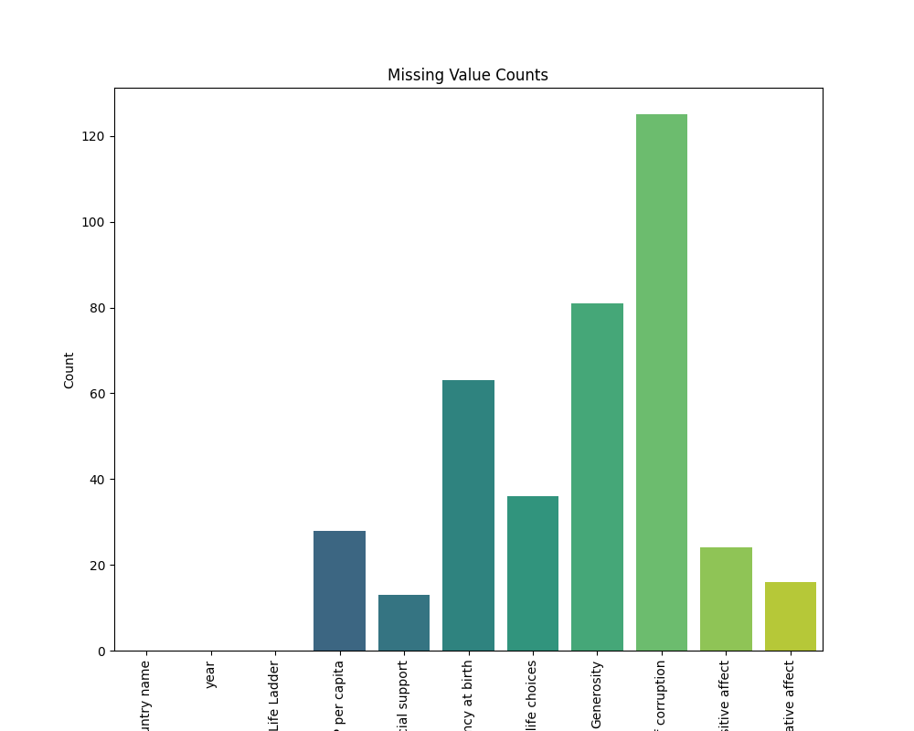
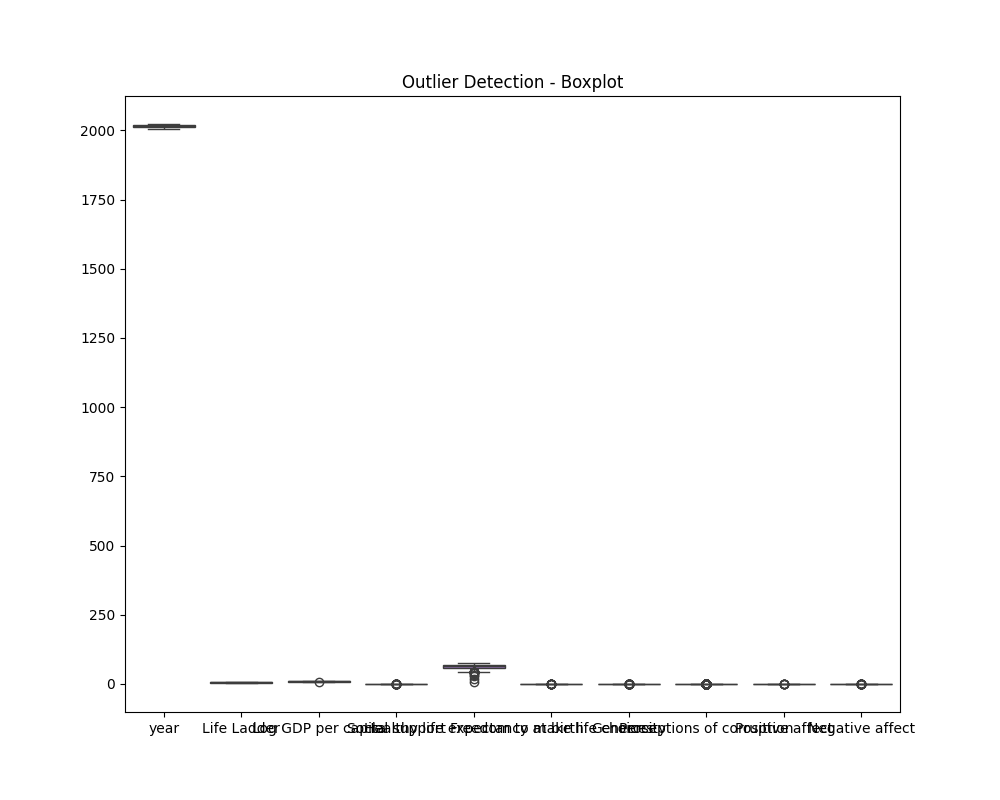

# Analysis Report

## Dataset Overview

Columns: Country name, year, Life Ladder, Log GDP per capita, Social support, Healthy life expectancy at birth, Freedom to make life choices, Generosity, Perceptions of corruption, Positive affect, Negative affect

## Analysis Summary

The dataset presents a broad collection of insights regarding various quality-of-life indicators across different countries from 2005 to 2023. Here are the key insights derived from the analysis:

### Key Insights:

1. **Data Composition**:
   - The dataset contains observations from 165 unique countries, with Lebanon being the most frequently represented.
   - The average Life Ladder score is approximately 5.48, indicating a moderate global sense of well-being among respondents, with an observed standard deviation of 1.13 suggesting some variance in life satisfaction across countries.

2. **Missing Values**:
   - Certain variables exhibit noteworthy missing data, particularly Generosity (3.43% missing) and Perceptions of Corruption (5.29% missing), which could impact analyses reliant on these factors.

3. **Correlations**:
   - A strong positive correlation exists between Life Ladder and Log GDP per capita (0.79), alongside Healthy life expectancy at birth (0.73). These correlations suggest that both economic prosperity and health are significant contributors to overall life satisfaction.
   - Freedom to make life choices (0.26) also demonstrates a positive relationship with life satisfaction, indicating the importance of individual autonomy in enhancing well-being.

4. **Skewness and Kurtosis**:
   - The distribution of several variables reveals skewness in social indicators. For example, the Social Support variable displays a significant left skew, potentially highlighting disparities in support systems within various countries.
   - Healthy life expectancy at birth has a high kurtosis value (2.77), indicating it has heavier tails than a normal distribution, which suggests that while many people are living long, some are facing extreme disparities.

5. **Feature Importance**:
   - The feature importance analysis indicates that while several predictors contribute to life satisfaction, Social Support and Healthy Life Expectancy are relatively more impactful compared to others such as Generosity and Positive Affect.

6. **Clusters**:
   - The analysis resulted in three distinct clusters, implying that countries can be categorized based on their overall life satisfaction and associated metrics. These clusters may represent different socio-economic and cultural landscapes that warrant deeper investigation.

7. **Geographical Patterns**:
   - The data spans from countries ranging in latitude, indicating varied demographic and cultural contexts, though no clear range for geographical latitude is provided in the summary.

### Implications:

- **Policy Formulation**: Understanding the strong associations between economic and health factors with life satisfaction can guide policymakers to prioritize economic development and

## Visualizations

