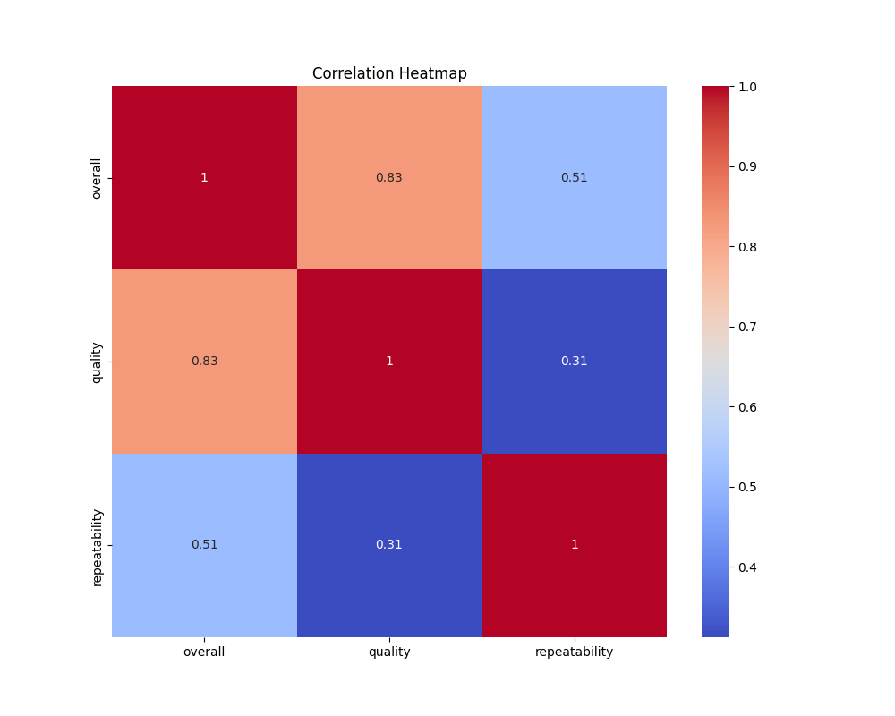
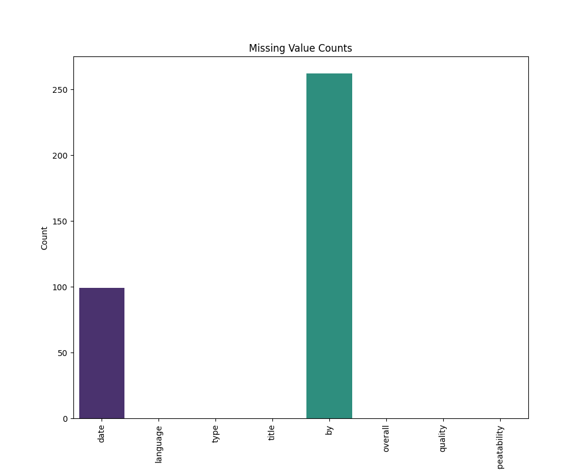
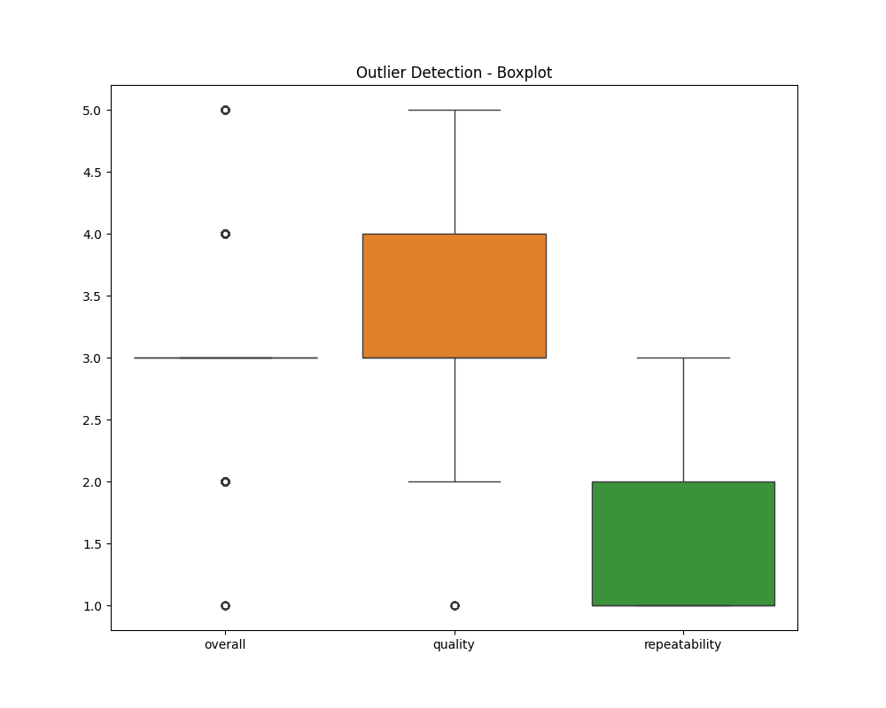

# Analysis Report

## Dataset Overview

Columns: date, language, type, title, by, overall, quality, repeatability

## Analysis Summary

The dataset comprises 2,652 entries highlighting various attributes, including metadata about films or media segments. Here are the key insights and patterns derived from the analysis:

1. **Data Composition**: 
   - The dataset features entries recorded over a significant time span, with 2,055 unique dates, emphasizing a diverse historical representation. However, 3.73% of the date entries have missing values, which may require attention for analysis that involves time-related trends.
   - The dataset is dominated by the English language (49.04% of entries) and primarily consists of movies (83.49%), suggesting a focus on English-language films.

2. **Entries and Authors**:
   - A total of 2,312 unique titles and 1,528 unique contributors ('by' field) indicate a rich variety of content and creative input.
   - Notably, the title "Kanda Naal Mudhal" appears to be the most frequent, indicating either a popular choice for data inclusion or possibly a significant work in the dataset's context.

3. **Quality Metrics**:
   - Quality, overall ratings, and repeatability have been systematically analyzed. The correlations suggest a strong relationship between overall ratings and quality (0.83), implying that higher quality typically coincides with better overall reception.
   - Repeatability presents a moderate correlation with overall ratings (0.51) but seems less relevant when compared to quality. This indicates quality factors more prominently influence the audience's perceptions than how consistent a title may be considered.

4. **Missing Values**:
   - The analysis revealed missing values predominantly in the 'by' field (9.88%) which may hinder a complete understanding of authorship and contributions.

5. **Feature Importance**:
   - Quality emerged as the most significant predictor of overall rating (55.70%), while repeatability holds lesser importance (17.53%). This suggests that improving perceived quality could substantially elevate overall ratings.

6. **Statistical Characteristics**: 
   - Skewness and kurtosis values for overall ratings are relatively low, indicating a normal distribution of the data — which is favorable for predictive modeling.
   - Outliers noted in overall ratings (1,216 occurrences) may require further investigation, as they could skew the analysis or suggest particularly high or low-rated entries.

7. **Clustering Patterns**:
   - The analysis of cluster labels indicates the existence of distinct groupings within the dataset, which may reflect varying types or genres of

## Visualizations

