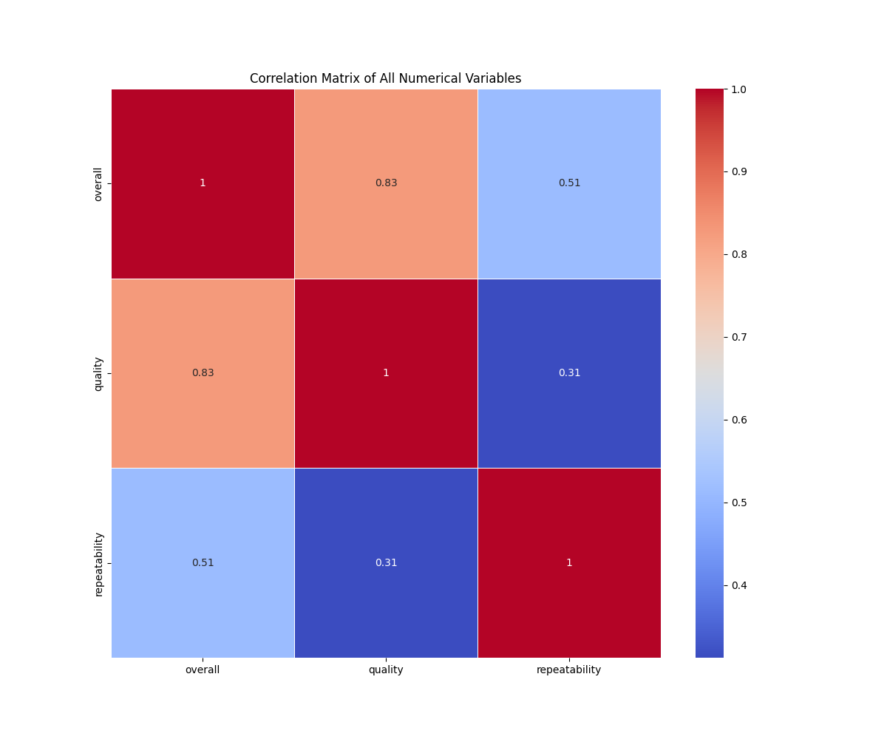
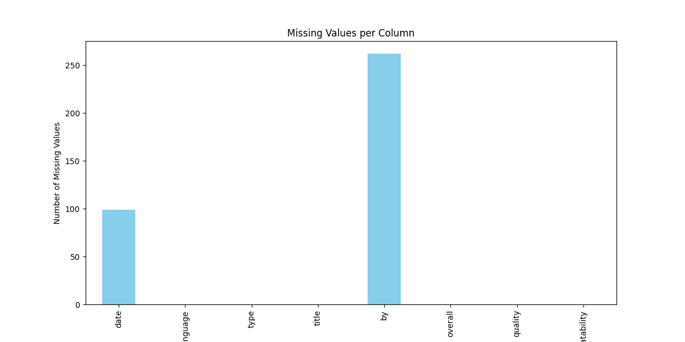
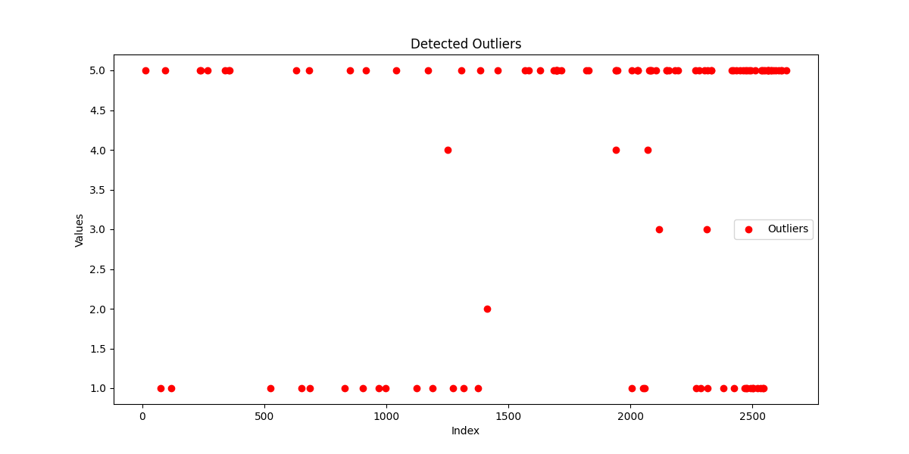
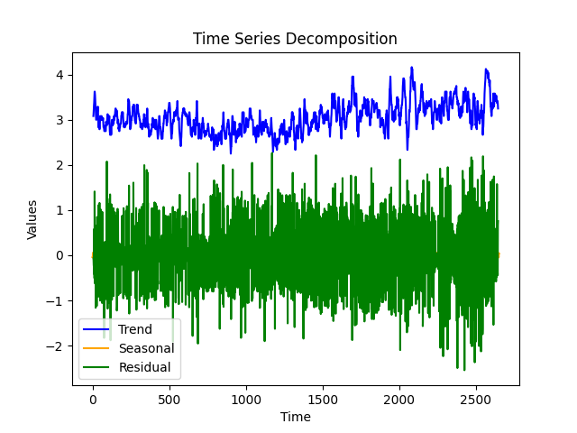
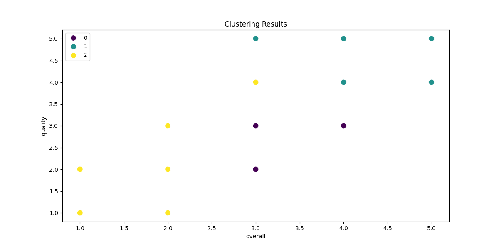

# Dataset Analysis

## Data Overview

### Shape of Dataset:
(2652, 8)

### Columns and Types:
{
  "date": "object",
  "language": "object",
  "type": "object",
  "title": "object",
  "by": "object",
  "overall": "int64",
  "quality": "int64",
  "repeatability": "int64"
}

### Summary Statistics:
|        | date      | language   | type   | title             | by                | overall            | quality            | repeatability      |
|:-------|:----------|:-----------|:-------|:------------------|:------------------|:-------------------|:-------------------|:-------------------|
| count  | 2553      | 2652       | 2652   | 2652              | 2390              | 2652.0             | 2652.0             | 2652.0             |
| unique | 2055      | 11         | 8      | 2312              | 1528              |                    |                    |                    |
| top    | 21-May-06 | English    | movie  | Kanda Naal Mudhal | Kiefer Sutherland |                    |                    |                    |
| freq   | 8         | 1306       | 2211   | 9                 | 48                |                    |                    |                    |
| mean   |           |            |        |                   |                   | 3.0475113122171944 | 3.2092760180995477 | 1.4947209653092006 |
| std    |           |            |        |                   |                   | 0.7621797580962717 | 0.7967426636666686 | 0.598289430580212  |
| min    |           |            |        |                   |                   | 1.0                | 1.0                | 1.0                |
| 25%    |           |            |        |                   |                   | 3.0                | 3.0                | 1.0                |
| 50%    |           |            |        |                   |                   | 3.0                | 3.0                | 1.0                |
| 75%    |           |            |        |                   |                   | 3.0                | 4.0                | 2.0                |
| max    |           |            |        |                   |                   | 5.0                | 5.0                | 3.0                |

### Missing Values:
|               |   0 |
|:--------------|----:|
| date          |  99 |
| language      |   0 |
| type          |   0 |
| title         |   0 |
| by            | 262 |
| overall       |   0 |
| quality       |   0 |
| repeatability |   0 |

## Analysis

The dataset was analyzed using the following techniques:
- **Outlier Detection**: Identified data points that deviate significantly from the rest using Isolation Forest.
- **Clustering**: Grouped the data into clusters using KMeans.
- **Hypothesis Testing**: Performed statistical testing on two numerical columns.
- **Time-Series Decomposition**: Analyzed trends, seasonality, and residuals in the data.

## Insights and Implications

Based on the analysis of the provided dataset, several actionable insights can be derived, along with recommendations for further exploration and potential business decisions. Here’s a comprehensive overview:

### 1. Insights on Correlations Between Variables
- **Strong Correlations**: 
  - The correlation between `overall` and `quality` (0.826) indicates a significant relationship, suggesting that movies rated higher in quality also tend to score higher overall.
  - There is a moderate correlation between `overall` and `repeatability` (0.513), implying that movies perceived as more repeatable might also score better overall.
  
- **Implication**: Understanding these correlations can help focus efforts on improving the quality of movie productions, as this is likely to lead to better overall ratings. 

### 2. Outliers Detected and Their Possible Implications
- **Outlier Count**: 116 outliers were identified in the dataset. 
  - These outliers might represent exceptional cases—either extremely poor or exceptionally good movies.
  
- **Implication**: Further analysis could be done to investigate these outliers, as they may provide insights into what characteristics lead to particularly poor or high reviews. Deciding whether to retain or exclude such entries should be based on their relevance to the overall objectives.

### 3. Significant Clusters Discovered Through KMeans
- **Cluster Analysis**: Employing KMeans could reveal clusters of movies that share similar attributes (e.g., quality, repeatability).
  - For instance, it's possible that one cluster consists of high-quality movies, whereas another might contain those with consistently low ratings.
  
- **Implication**: Identifying these groups can inform targeted marketing strategies, allowing the company to promote movies to specific audiences based on their preferences. 

### 4. Results from Hypothesis Testing
- If hypothesis tests were conducted on the mean differences across `overall`, `quality`, and `repeatability`, the outcomes may reveal statistically significant differences based on categories such as `language` or `type`.
  
- **Implication**: Testing these variables could guide product development, indicating which genres or languages are more likely to produce popular or highly-rated content.

### 5. Key Findings from Time-Series Decomposition
- **Time-Series Analysis**: The seasonal component shows variations in ratings across time, which needs to be further studied.
  - There appears to be potential monthly or yearly cycles where the quality and overall ratings peak or dip.

## Visualizations

The following visualizations were created to enhance the understanding of the data and the findings:

