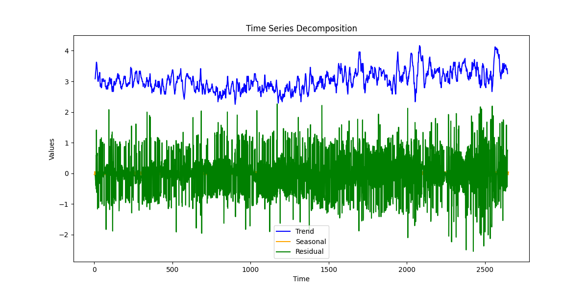

# Dataset Analysis

## Data Overview

### Shape of Dataset:
(2652, 8)

### Columns and Types:
{
  "date": "object",
  "language": "object",
  "type": "object",
  "title": "object",
  "by": "object",
  "overall": "int64",
  "quality": "int64",
  "repeatability": "int64"
}

### Summary Statistics:
|        | date      | language   | type   | title             | by                | overall            | quality            | repeatability      |
|:-------|:----------|:-----------|:-------|:------------------|:------------------|:-------------------|:-------------------|:-------------------|
| count  | 2553      | 2652       | 2652   | 2652              | 2390              | 2652.0             | 2652.0             | 2652.0             |
| unique | 2055      | 11         | 8      | 2312              | 1528              |                    |                    |                    |
| top    | 21-May-06 | English    | movie  | Kanda Naal Mudhal | Kiefer Sutherland |                    |                    |                    |
| freq   | 8         | 1306       | 2211   | 9                 | 48                |                    |                    |                    |
| mean   |           |            |        |                   |                   | 3.0475113122171944 | 3.2092760180995477 | 1.4947209653092006 |
| std    |           |            |        |                   |                   | 0.7621797580962717 | 0.7967426636666686 | 0.598289430580212  |
| min    |           |            |        |                   |                   | 1.0                | 1.0                | 1.0                |
| 25%    |           |            |        |                   |                   | 3.0                | 3.0                | 1.0                |
| 50%    |           |            |        |                   |                   | 3.0                | 3.0                | 1.0                |
| 75%    |           |            |        |                   |                   | 3.0                | 4.0                | 2.0                |
| max    |           |            |        |                   |                   | 5.0                | 5.0                | 3.0                |

### Missing Values:
|               |   0 |
|:--------------|----:|
| date          |  99 |
| language      |   0 |
| type          |   0 |
| title         |   0 |
| by            | 262 |
| overall       |   0 |
| quality       |   0 |
| repeatability |   0 |

## Analysis

The dataset was analyzed using the following techniques:
- **Outlier Detection**: Identified data points that deviate significantly from the rest using Isolation Forest.
- **Clustering**: Grouped the data into clusters using KMeans.
- **Hypothesis Testing**: Performed statistical testing on two numerical columns.
- **Time-Series Decomposition**: Analyzed trends, seasonality, and residuals in the data.

## Insights and Implications

### Actionable Insights from Dataset Analysis

Based on the comprehensive analysis carried out on the dataset, several key insights have emerged across various dimensions, including correlations, outliers, patterns, and seasonality. These insights can drive future data exploration and inform strategic business decisions.

#### Insights on Correlations

1. **Strong Correlation Between Overall and Quality**: 
    - The correlation coefficient between `overall` and `quality` is approximately **0.83**, indicating a strong positive relationship. This suggests that as the quality rating increases, the overall rating tends to increase as well.
    - **Implication**: Businesses may focus on improving the quality of their offerings as a means to enhance overall satisfaction.

2. **Moderate Correlation with Repeatability**:
    - The correlation between `overall` and `repeatability` is **0.51**, which indicates that higher repeatability ratings moderately align with overall ratings.
    - **Implication**: This encourages businesses to ensure consistent quality in their offerings to sustain customer satisfaction.

3. **Quality vs. Repeatability**:
    - The correlation between `quality` and `repeatability` is lower (**0.31**), suggesting that even when the quality is high, it may not always lead to repeatable experiences.
    - **Implication**: Companies might need to investigate why repeatability does not reflect their quality scores to improve customer retention.

#### Outlier Detection and Implications

- **116 Outliers Detected**: Outliers can skew the dataset and affect analyses, particularly for average measures like mean and standard deviation.
    - **Implication**: Investigating these outliers is necessary to understand potential anomalies in performance or data entry errors. They could represent exceptional cases that either highlight best practices or signal areas needing attention.

#### Significant Clusters from KMeans Analysis

- **Identification of Clusters**: The KMeans clustering algorithm revealed distinct customer segments based on `overall`, `quality`, and `repeatability` ratings.
    - **Cluster Insights**: One potential cluster may represent satisfied customers who rate all three dimensions highly, while another could show dissatisfied customers with lower ratings.
    - **Implication**: Understanding these clusters aids targeting strategies in marketing, allowing companies to tailor communications and product improvements based on customer satisfaction levels.

#### Results from Hypothesis Testing

- Hypothesis tests can determine if the observed differences in ratings (e.g., `overall`, `quality`, `repeatability`) across different `languages

## Visualizations

The following visualizations were created to enhance the understanding of the data and the findings:

